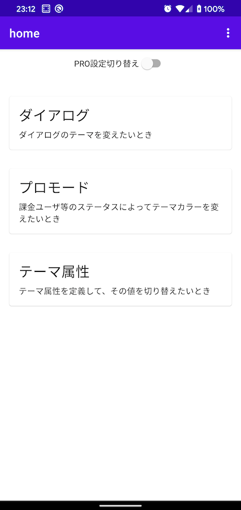
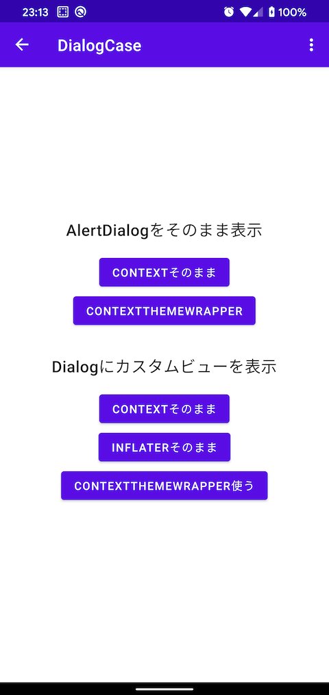
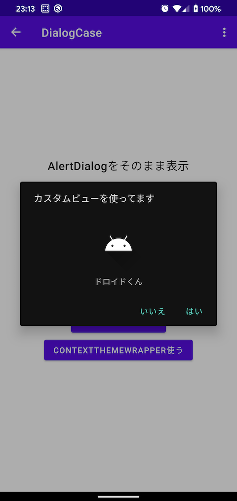
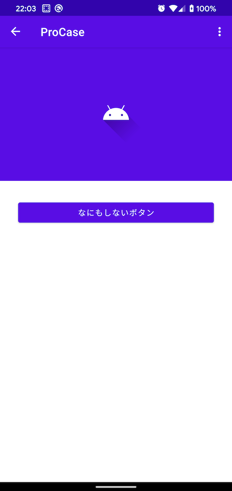
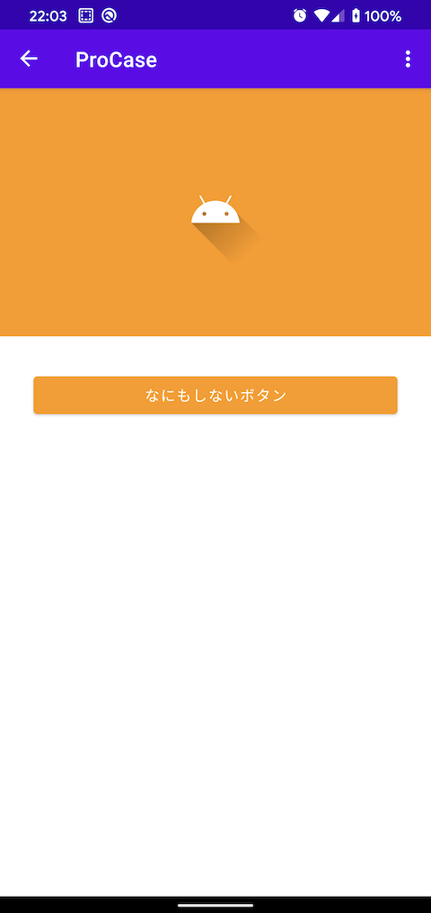
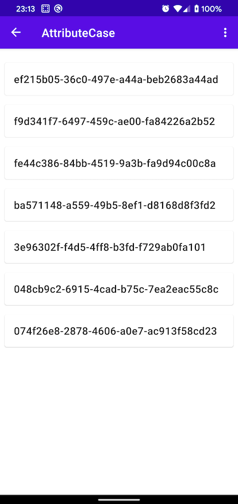

# android-theme-study

AndroidのThemeを試すリポジトリ  


## 扱っているもの

1. ダイアログとContext
2. ContextThemeWrapperでFragmentのthemeを置き換える
3. ContextThemeWrapperでtheme attributesを置き換える

### 1. ダイアログとContext

|ダイアログ一覧|カスタムViewを使ったダイアログ|
|:-:|:-:|
|||

```
// layoutInflaterを別のContextを使ってコピー
val themedInflater = layoutInflater.cloneInContext(context)
// コピーしたlayoutInflaterを使ってViewを生成
val customView =
    themedInflater.inflate(R.layout.view_dialog_body, null, false)
MaterialAlertDialogBuilder(context)
    .setTitle("カスタムビューを使ってます")
    .setView(customView)
    .setPositiveButton("はい") { dialog, _ -> dialog.dismiss() }
    .setNegativeButton("いいえ") { dialog, _ -> dialog.dismiss() }
    .show()
```

カスタムViewを使う場合によく色の指定で混乱することがあるが、Dialogに限らず`layoutInflater`をクロンして所望のthemeを使うようにするとよさそう。

### 2. ContextThemeWrapperでFragmentのthemeを置き換える

|通常版|PRO版|
|:-:|:-:|
|||

```
override fun onCreateView(
    inflater: LayoutInflater,
    container: ViewGroup?,
    savedInstanceState: Bundle?
): View? {
    val themedInflater: LayoutInflater = if (status.isProMode) {
        inflater.cloneInContext(
            ContextThemeWrapper(requireContext(), R.style.AndroidThemeStudy_Pro)
        )
    } else inflater
    return super.onCreateView(themedInflater, container, savedInstanceState)
}
```

`onCreateView`で`inflater`に使うContextを`ContextThemeWrapper`を使ってthemeを置き換えているだけ。  
置き換えていると言っても、指定したtheme attributesのみ上書きという挙動になる。

### 3. ContextThemeWrapperでtheme attributesを置き換える

|HOME画面のリスト|AttributeCasのリスト|
|:-:|:-:|
|||

`marginContent`/`titleTextSize`というtheme attributesを独自に追加している。

```
<!-- attrs.xml -->
<resources>
    <declare-styleable name="Theme">

        <attr name="titleTextSize" format="dimension" />
        <attr name="marginContent" format="dimension" />
    </declare-styleable>
</resources>
```

ホーム画面とAttributeCaseのリストにはそれぞれ`?attr/marginContent`と`?attr/titleTextSize`を設定している。  
AttributeCaseのFragmentでは`AndroidThemeStudy.Dense`のテーマを使っているため、同じtheme attributesを使っているホーム画面のリストとは違ったマージン・文字サイズが適用される。

```
<style name="AndroidThemeStudy.Dense">
    <item name="titleTextSize">18sp</item>
    <item name="marginContent">8dp</item>
</style>
```
